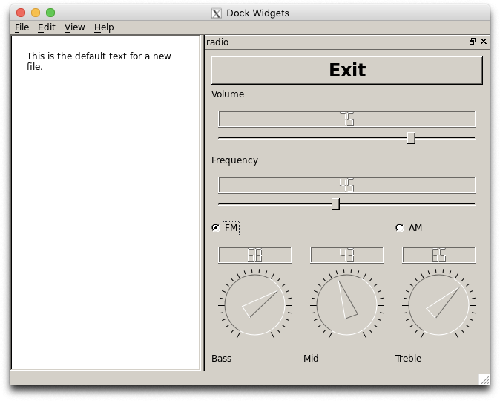

Simple QT Radio
=======================

A demonstration of UI development using QT by expanding on the original [simple QT radio](https://github.com/kevin-funderburg/simple-qt-radio) and placing it within a window with menus, along with a text edit area that can be edited and saved as a text file.

<!-- MarkdownTOC autolink="true" bracket="round" depth="3" autoanchor="true" -->

- [Features](#features)
- [Installation](#installation)
- [Usage](#usage)
    - [Configuration](#configuration)
- [Licensing & thanks](#licensing--thanks)
- [Changelog](#changelog)

<!-- /MarkdownTOC -->

Features
--------

- This was executed on Linux using QT 4.7.

Installation
------------

- To bypass VM use, I utlized [@Grant Slape](https://github.com/grantslape/)'s great [Dockerfile](https://github.com/grantslape/docker-qt4.7)

Usage
-----

- [enter information about using docker]

### Configuration ###

Version History
---------

- v1.0.0
